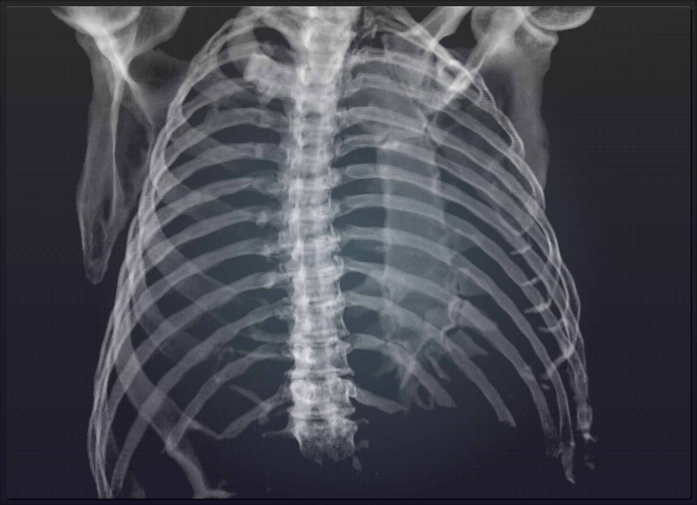
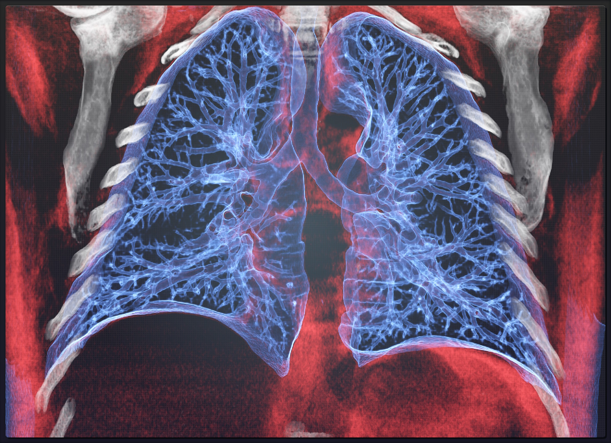
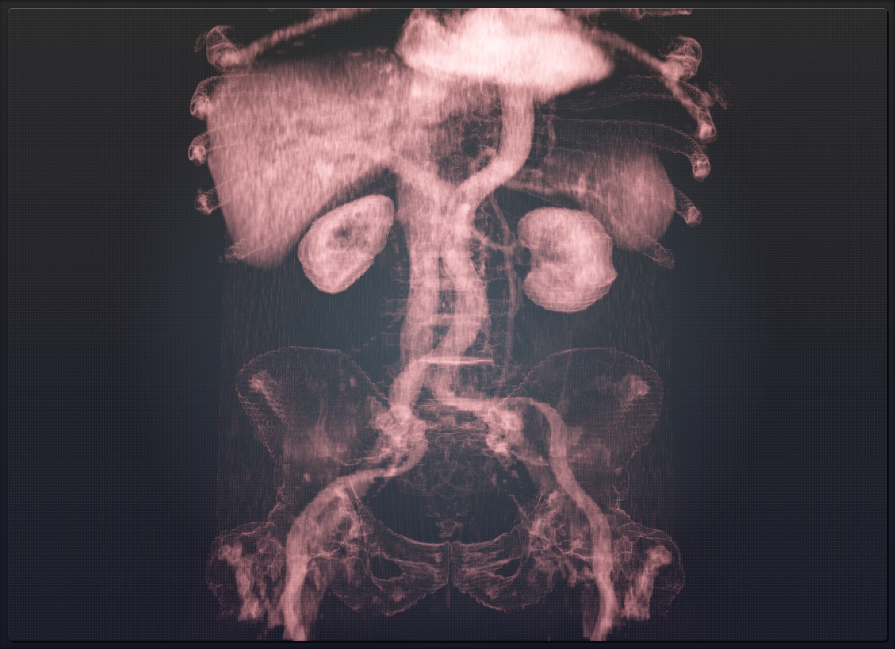
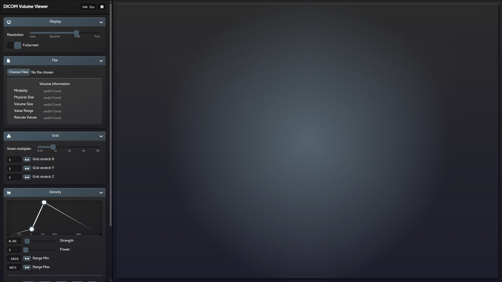

---

> [!WARNING]
> This project is still work in progress, so expect some bugs...

---

### DICOM Volume Viewer

This is a browser app for viewing volumes in DICOM files. DICOM is a standard for sharing a wide variety medical information, but the focus here are 3D scans such as MRI or CT. It renders a volume of points that have density values using the ray voxel traversal algorithm. The most notable features are: isolating certain density values with a density graph, slicing the volume into smaller sections and adjusting the resolution.

> https://martzin23.github.io/dicom-volume-viewer/

---

### Screenshots

> [!NOTE]
> Scans used in these screenshots are publicly available samples taken from https://saga-it.com/dicom/samples.

#### Chest skeleton

#### Brain slice

#### Lung slice

#### Kidneys

#### User interface

---
